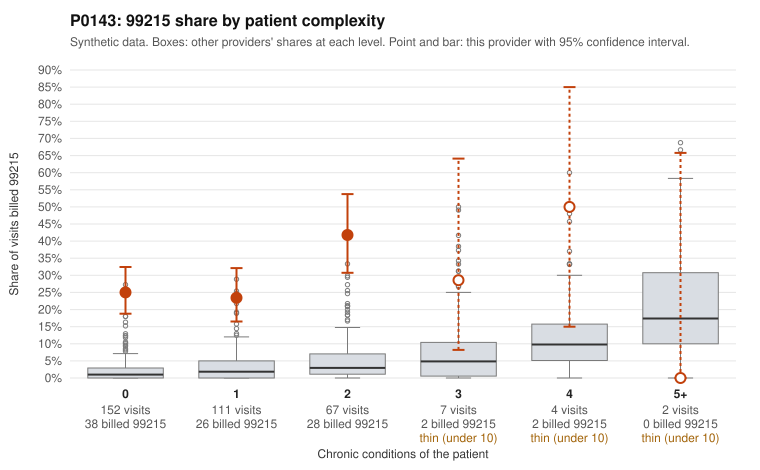

# P0143: P0143 (Family Practice, GA): 28% 99215 share on a mostly low-complexity panel, and 30 of 35 documented 99215 claims are unsupported. The pattern is consistent with upcoding.

**Leaning (advisory):** Pattern consistent with upcoding

## Why

P0143 billed 96 of 343 claims (28.0%) as 99215. The expected share given patient complexity is about 2.1% (z vs peers 3.45, risk-adjusted score 12.0). The panel is not sicker than average: 263 of 343 visits are for patients with 0-1 chronic conditions, and only 6 visits are for patients with 4+ conditions. On patients with no chronic conditions, the provider's 99215 share is 25%, against 2.1% for all providers. Sampled 99215 claims on low-complexity patients include routine-looking diagnoses: upper respiratory infection (J06.9; C0066276, C0066590), low back pain (M54.50; C0066395, C0066604), rash (R21; C0066483) and UTI (N39.0; C0066558). Documentation strengthens the concern. Of 35 documented 99215 claims, 30 (85.7%) were not supported by the documented level, against 24.2% for all providers. Examples include C0066376 and C0066431, both documented as moderate MDM at 32-34 minutes. The 99214 unsupported rate is also elevated (20.4% vs 8.4%; e.g., C0066383, documented as low MDM at 20 minutes). A few 99215 claims are supported, such as C0066612 (high MDM, 41 minutes) for a heart-failure patient. Limitations: documentation covers only 29% of claims, the claim lists are samples, and documentation is noisy. Even so, the gap is large. This is a pattern for review, not a finding of fraud.

## Evidence chart

## Cited claims

`C0066276`, `C0066590`, `C0066395`, `C0066604`, `C0066483`, `C0066558`, `C0066376`, `C0066431`, `C0066383`, `C0066612`

## Suggested next steps

- Request full medical records for all 96 billed 99215 claims, and a sample of 99214 claims, and have a certified coder audit MDM elements and time against 2021+ E/M guidelines.
- Check whether 99215 claims billed on time (40+ minutes) have contemporaneous time attestations; documented minutes in the unsupported examples were 32-38.
- Look for templated or cloned notes across the low-complexity 99215 visits, such as repeated URI, back pain and rash encounters.
- Review the 99214 claims with low documented MDM (e.g., C0066369, C0066371, C0066434) to see whether level inflation is systematic across levels.
- Compare against the provider's prior-year billing mix to see whether the 99215 share changed abruptly, and check for any coding education or prior audit history.

---
Citations checked: 10/10 valid. Synthetic data. The leaning is advisory; the flag comes from the statistical screen, and no clinical documentation is available beyond the sampled records-review facts shown in the packet.
